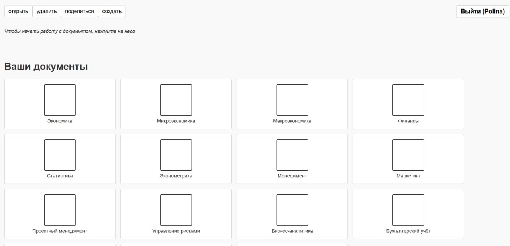

# Документация для пользователя: Conspektor — система совместного редактирования документов

## О системе
Conspektor — это веб-платформа для создания и совместного редактирования документов в реальном времени. Несколько пользователей могут одновременно работать над одним документом, видеть изменения друг друга и обсуждать правки.

## Быстрый старт

### Вход в систему
1. **Откройте браузер** и перейдите по адресу: `http://localhost:8080`
2. **Введите имя пользователя** в поле ввода или выберите из предложенных ниже:
   - Доступные тестовые пользователи:
     - `Boris`
     - `Nikita` 
     - `Ivan`
     - `Polina`
3. **Нажмите "Войти"**

### Обзор личного кабинета
После входа вы увидите **список документов**, разделенный на две категории:

- **Ваши документы** — документы, которые вы создали
- **Общие документы** — документы, к которым вам предоставили доступ другие пользователи

## Основные возможности

### 1. Создание нового документа
1. **Нажмите кнопку "создать"** в личном кабинете
2. **Введите название** нового документа
3. **Подтвердите форму и обновите страницу**

### 2. Для открытия документа
1. **Кликните на документ** 
2. **Выберите кнопку "открыть"** и подтвердите форму

### 3. Редактирование документа
1. **Выберите и откройте файл** кликом мыши
2. **Начните вводить текст**
3. **Для использования различных шрифтов** выберите соответствующую кнопку сверху
4. **Также можно настраивать цвет** уже введенного или вводимого текста

### 4. Пригласить соавтора
1. **Кликом мыши** выберите нужный документ
2. **Нажмите кнопку "поделиться"** и введите имя соавтора
3. **Подтвердите ввод**

### 5. Удаление документов
1. **Выберите документ** кликом мышки
2. **Нажмите кнопку "удалить"** и подтвердите форму
   
**Удаление документов доступно только владельцу документа!**

#### История изменений
- **Все изменения сохраняются** автоматически
- Система отслеживает, **кто и когда вносил правки**

#### Как работать совместно:
- Все участники видят изменения в **реальном времени**
- **Изменения синхронизируются автоматически** — не нужно обновлять страницу

## Технические детали для пользователя

### Автосохранение
- **Изменения сохраняются каждые 2 секунды**
- **При потере соединения** система пытается восстановить связь
- **При перезагрузке страницы** документ восстановится из последней сохраненной версии

### Совместимость
- **Работает в современных браузерах**:
- **Не требуется установка** дополнительных программ
- **Поддерживает мобильные устройства**