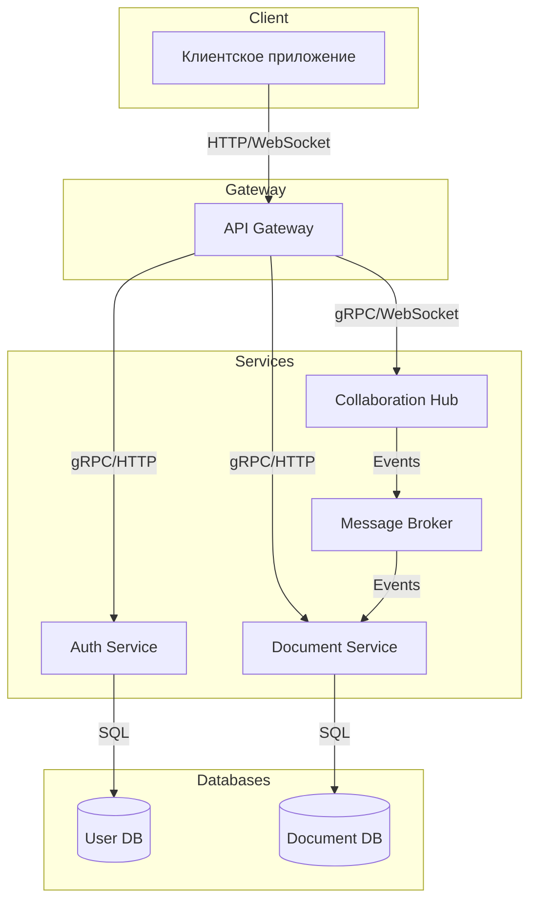
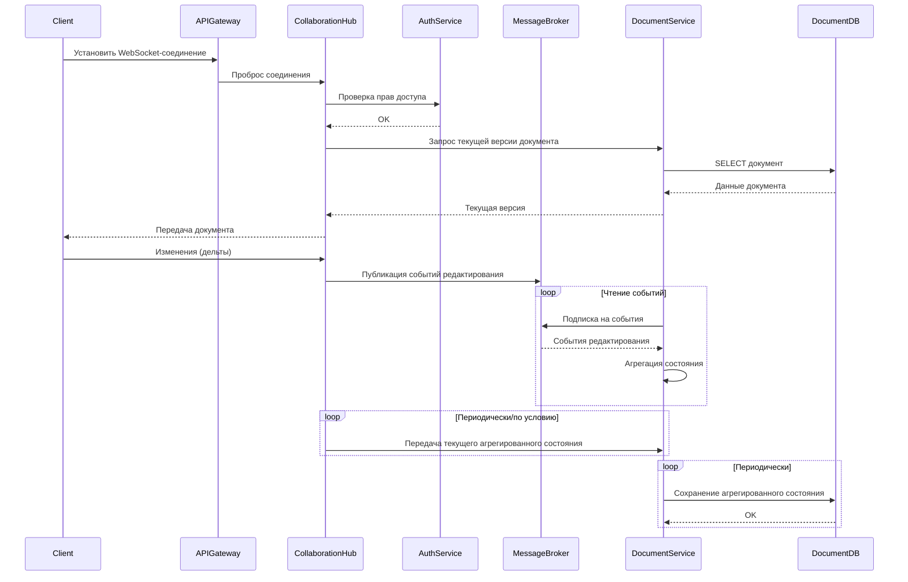
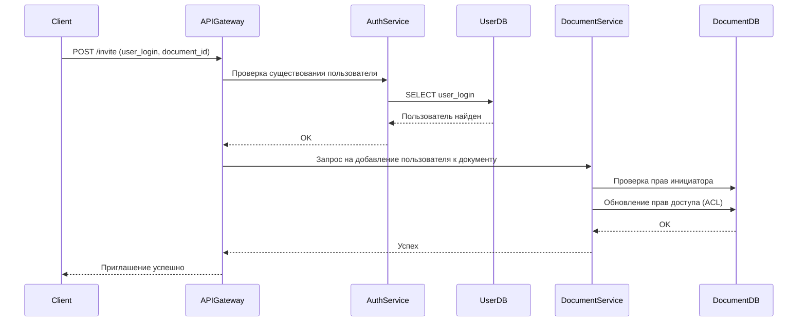
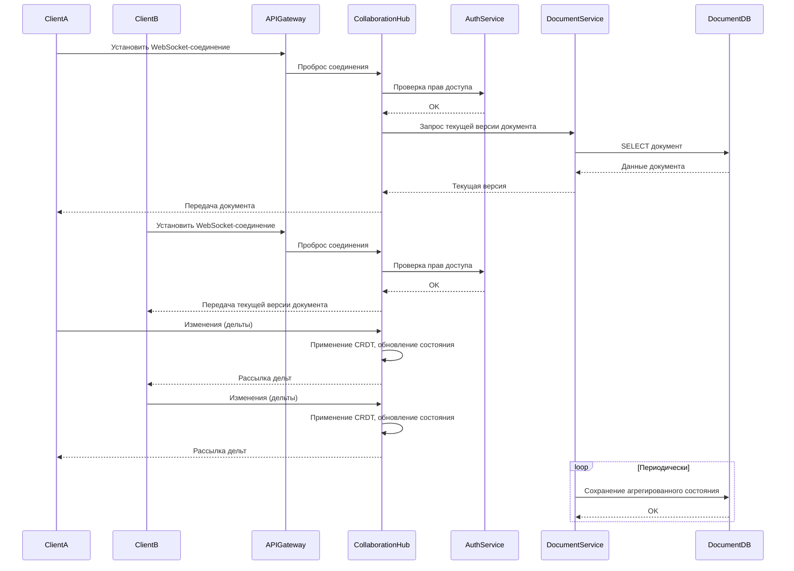

# Техническое решение проекта «Конспектор»

## 1. Введение
«Конспектор» — многопользовательское приложение для студентов, предназначенное для одновременного совместного ведения и редактирования конспектов. Система позволяет пользователям в реальном времени работать над документами, писать формулы, прикреплять изображения. Проект демонстрирует ключевые принципы построения синхронных, отказоустойчивых и масштабируемых распределённых приложений.
- **Цель проекта:** реализовать прототип распределённой системы, позволяющей пользователям в реальном времени редактировать документ.
- **Задачи:** закрепить теоретические основы распределённых систем (масштабируемость, отказоустойчивость, консистентность) через практическую реализацию.  
- **Основания для разработки:** учебный проект в рамках курса «Основы распределённых вычислений».  
- **Команда:** Гончаров Иван — DevOps, Лукьянова Полина — Back-end разработчик, Музиров Борис — team-lead, Пирогов Никита — Front-end разработчик
---

## 2. Глоссарий
| Термин        | Определение |
|---------------|-------------|
| Пользователь  | Зарегистрированный клиент системы. |
| Редактирование| Создание, изменение, удаление и иные операции, относящиеся к изменению содержимого файла. | 
| Документ | Текстовый файл, который можно создавать, редактировать и работать над ним совместно с другими пользователями. |
| Совместное редактирование | Совокупность действий, осуществляемых с одним документом одновременно несколькими пользователями |
| WebSocket  | Протокол для организации постоянного соединения между клиентом и сервером для двустороннего обмена данными в реальном времени. |
| CRDT  | Алгоритм (Conflict-free Replicated Data Type), применяемый для согласованного редактирования документов несколькими участниками. |

---

## 3. Функциональные требования
Система должна предоставлять следующие функции:
1. Совместное редактирование документов в реальном времени.  
2. Добавление математических формул, графиков, изображений.  
3. Возможность распределять доступ и права редактирования между пользователями.  

### Ограничения на предметную область

1. Доступ к просмотру и редактированию имеют только зарегистрированные и приглашенный пользователи.
2. Количество одновременно работающих в файле пользователей ограничено (не более 10).
3. Все математические выражения оформляются с использованием синтаксиса LaTeX.
4. Графики и диаграммы поддерживаются через блоки Mermaid.

---

## 4. Нефункциональные требования
- **Доступность:** 75%. По требованию может увеличиваться.  
- **Масштабируемость:** возможность увеличения числа узлов без модификации логики.  
- **Время отклика:** ≤ 200 мс в условиях локальной сети.  
- **Отказоустойчивость:** система должна продолжать работать при сбое одного из узлов.  
- **Консистентность:** отсутствие рассинхронизаций, одинаковое отображение документов и их содержимого для всех пользователей.  

---

## 5. Пользовательские сценарии

### Сценарий: редактирование документа
1. Пользователь выбирает доступный ему документ, открывает его и попадает в режим редактирования.
2. Пользователь вносит все необходимые ему измениения.
3. Система сохраняет изменения в облачное хранилище.

### Сценарий: приглашение пользователя
1. Пользователь выбирает существующий документ и открывает список пользователей, имеющих доступ к редактированию файла.
2. Пользователь добавляет логин нового пользователя в список.
3. Если данный логин существует, система предоставляет права редактирования новому пользователю.
4. Документ отображается в меню файлов нового пользователя.

### Сценарий: совместное редактирование документа
1. Пользователь выбирает документ, редактируемый в данный момент другим пользователем, открывает его и попадает в режим совместного редактирования.
2. Пользователь в реальном времени видит изменения, вносимые другими пользователями.

## 6. Архитектура

Основные компоненты:
1. API Gateway — единая точка входа, маршрутизация HTTP и WebSocket запросов.
2. Document Service — сервис хранения и обработки документов.
3. Collaboration Hub — сервис синхронизации в реальном времени между пользователями (через WebSocket) Применяет CRDT-алгоритм
4. Document DB — база данных для хранения документов.
5. Auth Service — сервис аутентификации и авторизации пользователей.
6. User DB — база данных пользователей и прав доступа.
7. Message Broker — для рассылки событий синхронизации и уведомлений.

## 7. Технические сценарии
### Сценарий: подключение к документу и одиночное редактирование
1. Клиент открывает документ и устанавливает WebSocket-соединение с Collaboration Hub через API Gateway.
2. Collaboration Hub проверяет права доступа через Auth Service.
3. После успешной авторизации клиент получает текущую версию документа из Document Service.
4. Все изменения, вносимые клиентом, Collaboration Hub обрабатывает локально и публикует события редактирования в Message Broker.
5. Document Service читает события из Message Broker, агрегирует изменения и формирует текущее состояние документа.
6. Периодически или по условию Collaboration Hub отправляет агрегированное состояние документа в Document Service (например, для консистентности или снапшота).
7. Document Service периодически сохраняет агрегированное состояние документа в Document DB.

### Сценарий: приглашение пользователя
1. Пользователь-инициатор открывает документ и выбирает опцию «Пригласить пользователя».
2. Клиентское приложение отправляет через API Gateway запрос на изменение права доступа
3. API Gateway перенаправляет запрос в Auth Service для проверки существования приглашённого пользователя.
4. Auth Service обращается к User DB и возвращает результат проверки.
5. Если пользователь существует, запрос передаётся в Document Service. 
6. Document Service проверяет права инициатора (должен быть владельцем или администратором документа). В случае успеха Document Service обновляет Document DB, добавляя нового пользователя с нужным уровнем доступа.
7. Приглашённый пользователь видит документ в своём списке

### Сценарий: подключение к документу и совместное редактирование с синхронизацией
1. Клиент открывает документ и устанавливает WebSocket-соединение с Collaboration Hub через API Gateway.
2. Collaboration Hub проверяет права доступа через Auth Service.
3. После успешной авторизации клиент получает текущую версию документа из Document Service.
4. Все изменения пользователя отправляются через WebSocket на Collaboration Hub.
5. Collaboration Hub применяет алгоритм CRDT, обновляет состояние документа и рассылает дельты другим клиентам.
6. Document Service периодически сохраняет агрегированное состояние документа в базу.

## 8. План разработки и тестирования

### 8.1 Основной проект (MVP)
**Включает:**
- Создание и хранение документов
- Базовое редактирование документов в реальном времени с использованием WebSocket
- Синхронизация через Collaboration Hub

**План разработки:**
1. Проектирование API (Document, Collaboration)
2. Реализация API Gateway
3. Реализация Document Service (CRUD для документов)
4. Реализация Collaboration Hub (WebSocket, синхронизация в реальном времени)
5. Интеграция с Document DB
6. Интеграция с брокером сообщений (Message Broker)

**План тестирования:**
- Модульный тест для Document Service
- Интеграционные тесты Collaboration ↔ Document
- Тесты WebSocket соединений и рассылки обновлений
- Проверка разрешения возможных конфликтов: Одновременное редактирование одной и той же строки, вставка в одну позицию, Одновременные правки в соседних позициях, Быстрая серия операций.
- Нагрузочные тесты на большое количество пользователей (более 20)
- Тесты на конкурентное редактирование (максимально возможное (10) количество пользователей)

**Definition of Done (DoD) для MVP:**
MVP считается завершённым, если:
- Документы успешно сохраняются в системе
- Реализовано редактирование документов в реальном времени
- При одновременном редактировании документа двумя пользователями конфликты разрешаются автоматически
- Написаны и успешно пройдены базовые модульные и интеграционные тесты.
- Подготовлена пользовательская документация по запуску и базовому использованию системы.

### 8.2 Расширенный проект (Advanced Scope)
**Включает:**
- Авторизация пользователей
- Расширенные права доступа (просмотр, комментирование, редактирование)
- Поддержка вставки формул, графиков и изображений

**План разработки:**
1. Реализация Auth Service (регистрация, логин, права доступа)
2. Реализация вставки и синхронизации дополнительных типов контента

**План тестирования:**
- Модульный тест для Auth Service
- Тесты на корректность вставки и отображения мультимедийного контента
- Тесты прав доступа

**Definition of Done (DoD) для расширенного проекта:**
Advanced Scope считается завершённым, если выполнены все пункты MVP, а также:
- Продемонстрирована работа новой ролевой модели
- Реализована регистрация и авторизация пользователей.
- Реализованы расширенные механизмы управления доступом к документам (разграничение ролей, отзыв прав, приглашения).
- Реализована поддержка формул и диаграмм (LaTeX и Mermaid).
- Написаны и успешно пройдены базовые модульные и интеграционные тесты.